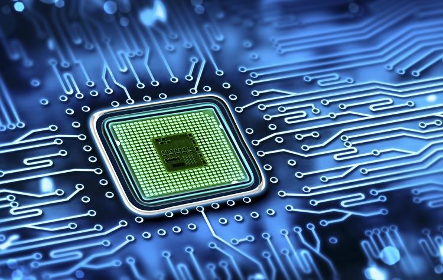

# Lab 1
## Хід роботи
1. Склонував власний репозиторій на локальну машину. Використав команду "git clone <url репозиторію>"
2. Хеш коміту 235904de0cfebefdf6b881398fbe0636592c4c33, хеш попереднього коміту 52ca8f43f36c5377b2c2a5eb83834dbcbdcc9670.
    ##### Використовував таку послідовність команд:
       "git add ."
       "git commit -m "Lab_1: мій перший коміт""
       "git push"
3. Для створення та переходу до гілки Branch1 використав команди "git branch" та "git checkout".
4. Зміни не з'явились у гілці master тому, що ми зробили коміт лише на гілці Branch1.
5. Під час злиття гілки Branch1 та master виник конфлікт через різницю в файлі README.md, конфлікт виправив через злиття в Intellij Idea.
6. Відредагував файл README.md через WEB версію GitHub.
7. У локальній версії змін не було. Для того щоб оновити локальну версію, використав команду "git pull".
8. Додав картинку.  
