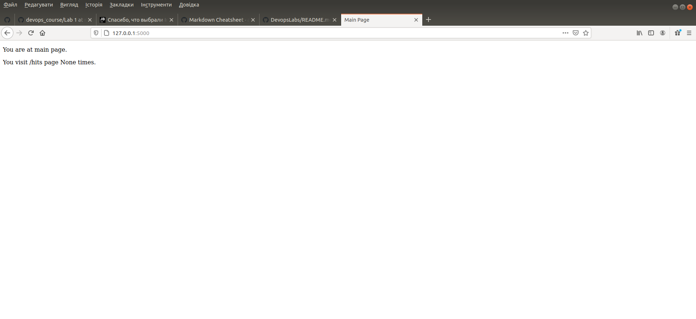
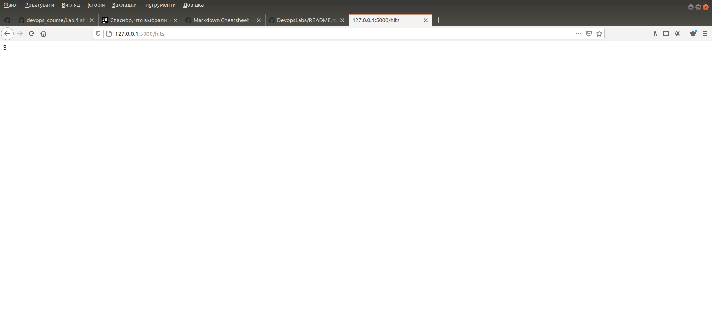
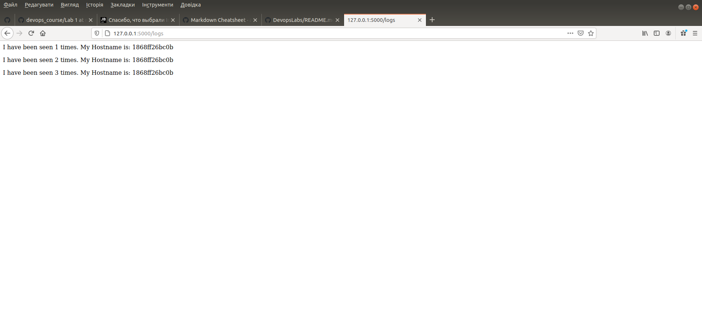

# Lab 5
## Хід роботи
1. Ознайомився з docker-compose та документацією до нього;
2. Ознайомився з бібліотекою Flask та документацією до неї;
3. Створив папку ```my_app``` в якій буде знаходитись мій проект. Створив папку ```tests``` де будуть тести на перевірку працездатності мого проекту. Скопіював файли з цього репозиторію у відповідні папки. Ознайомився із вмістом кожного з файлів. У файлі ```requirements.txt``` вказуються бібліоткеки Python, які будуть викоритовуватись в цьому додатку.
4. Виконав наступні команди та перевірив працездатність проекту:
    
       pipenv --python 3.8
       pipenv install -r requirements.txt
       pipenv run python app.py
       ---------------------------------------------------------------------------
       user@Pc:~/GitRepos/DevopsLabs/Lab5/my_app$ pipenv --python 3.8
       Creating a virtualenv for this project...
       Pipfile: /home/user/GitRepos/DevopsLabs/Lab5/Pipfile
       Using /usr/bin/python3.8 (3.8.0) to create virtualenv...
       ⠹ Creating virtual environment...created virtual environment CPython3.8.0.final.0-64 in 130ms
         creator CPython3Posix(dest=/home/user/.local/share/virtualenvs/Lab5-KdBzUHKH, clear=False, global=False)
         seeder FromAppData(download=False, pip=bundle, wheel=bundle, setuptools=bundle, via=copy, app_data_dir=/home/user/.local/share/virtualenv)
           added seed packages: pip==20.2.4, setuptools==50.3.2, wheel==0.35.1
         activators PythonActivator,FishActivator,XonshActivator,CShellActivator,PowerShellActivator,BashActivator
       
       ✔ Successfully created virtual environment! 
       Virtualenv location: /home/user/.local/share/virtualenvs/Lab5-KdBzUHKH
       Creating a Pipfile for this project...
       ---------------------------------------------------------------------------
       user@Pc:~/GitRepos/DevopsLabs/Lab5/my_app$ pipenv install -r requirements.txt
       Requirements file provided! Importing into Pipfile...
       Pipfile.lock not found, creating...
       Locking [dev-packages] dependencies...
       Locking [packages] dependencies...
       Building requirements...
       Resolving dependencies...
       ✔ Success! 
       Updated Pipfile.lock (dff687)!
       Installing dependencies from Pipfile.lock (dff687)...
         🐍   ▉▉▉▉▉▉▉▉▉▉▉▉▉▉▉▉▉▉▉▉▉▉▉▉▉▉▉▉▉▉▉▉ 7/7 — 00:00:02
       To activate this project's virtualenv, run pipenv shell.
       Alternatively, run a command inside the virtualenv with pipenv run.
       ---------------------------------------------------------------------------
       user@Pc:~/GitRepos/DevopsLabs/Lab5/my_app$ pipenv run python app.py
        * Serving Flask app "app" (lazy loading)
        * Environment: production
          WARNING: This is a development server. Do not use it in a production deployment.
          Use a production WSGI server instead.
        * Debug mode: on
        * Running on http://0.0.0.0:5000/ (Press CTRL+C to quit)
        * Restarting with stat
        * Debugger is active!
        * Debugger PIN: 234-299-647
5. Ініціалізував середовище для тестів у іншій вкладці шелу та запустив командою
        
       pipenv run pytest test_app.py --url http://localhost:5000
    
   Виникли деякі проблеми з тестуванням програми. Усі ці проблеми спричинені декількома моментами, які мають бути вирішені перед запуском сервера:
   * На локальній машині має бути запущений сервер Redis. Також програма має бути налаштована, щоб використовувати його.
   * Програма не змогла створити директорію для файлів логування. Треба було створити її вручну.
   
   Після виправлення усіх неполадок усе запрацювало як має бути.
6. Видалив файли які були створені після тестового запуску. Створив два Dockerfile з іменами як у цьому репозиторії та Makefile який допоможе автоматизувати процес розгортання.
7. Ознайомився із вмістом Makefile та його директивами:
        
   * app - запускає зборку ```docker``` для ```Dockerfile.app``` та білдить контейнер додатку.
   * tests - запускає зборку ```docker``` для ```Dockerfile.tests``` та білдить контейнер для тестування додатку.
   * run - створює ```docker container network```, запускає контейнер ```Redis```, запускає контейнер ```app```.
   * test-app - запускає контейнер для тестування додатку.
   * docker-prune - очищає усі невикористовувані контейнери, з'єднання, волюми та імеджі.
8. Використовуючи команду make створив Docker імеджі для додатку та для тестів. Запустив додаток та перейшовши в іншу вкладку шелу запустив тести. Переконався що тести пройшли успішно.
        
        user@Pc:~/GitRepos/DevopsLabs/Lab5$ make run
        eec326fea32cbb4df52649e6a60a78e701ba9eb767a1e5c2fb75477960963a97
        bfdb704c077c1be9249925617dafb05c90cc3b13034a4f411430c21619fbbd7a
        1868ff26bc0ba1ddac4ee7f05c1447ca8000af9b3e5a93160c896953a0e1939f
        ---------------------------------------------------------------------
        user@Pc:~/GitRepos/DevopsLabs/Lab5$ make test-app
        [sudo] пароль до user: 
        ============================================== test session starts ==============================================
        platform linux -- Python 3.8.7, pytest-6.2.1, py-1.10.0, pluggy-0.13.1
        rootdir: /tests
        collected 4 items                                                                                               
        
        test_app.py ....                                                                                          [100%]
        
        =============================================== 4 passed in 0.12s ===============================================

9. Скріншоти роботи сторінок:



10. Очистив усе за допомогою директиви make docker-prune
11. Створив директиву ```push``` та завантажив імеджі до свого репозиторію
        
        push:
             @$(foreach state,$(STATES), docker push $(REPO):$(state);)
12. Створив директиву ```delete-images``` та видалив усі імеджі з локальної машини:
        
        delete-images:
           @sudo docker image rm --force $(shell docker images -q)
        ---------------------------------------------------------------------------------------------------
        user@Pc:~/GitRepos/DevopsLabs/Lab5$ docker images
        REPOSITORY                 TAG                 IMAGE ID            CREATED             SIZE
        vyacheslavbeltyukov/lab5   tests               c26ddf39b2d2        47 minutes ago      147MB
        vyacheslavbeltyukov/lab5   app                 1115288f2a7c        53 minutes ago      143MB
        python                     3.8-alpine          64df5e2068e3        12 days ago         44.5MB
        python                     3.8                 f5041c8ae6b1        12 days ago         884MB
        vyacheslavbeltyukov/lab4   monitoring          b2f95073b265        3 weeks ago         319MB
        vyacheslavbeltyukov/lab4   django              50fc18426637        3 weeks ago         319MB
        redis                      latest              ef47f3b6dc11        3 weeks ago         104MB
        python                     3.6-slim            7fcd5f355774        3 weeks ago         111MB
        docker/whalesay            latest              6b362a9f73eb        5 years ago         247MB
        ---------------------------------------------------------------------------------------------------
        user@Pc:~/GitRepos/DevopsLabs/Lab5$ docker images
        REPOSITORY                 TAG                 IMAGE ID            CREATED             SIZE
13. Перейшов до іншого варіанту з використанням ```docker-compose.yml```. Для цього створив даний файл у кореневій папці проекту та заповнив вмістом з прикладу. У нас будуть дві мережі:
    * Перша публічна для зв'язку з нашим сайтом
    * Друга закрита (secret) для зв'язку з ```redis```
14. Запустив ```docker-compose```:
        
        docker-compose -p lab5 up
15. Перевірив чи працює веб-сайт. Потрібно зайти на адресу 127.0.0.1:80.
16. Перевірив чи ```docker-compose``` створив потрібні імеджі на локальній машині:
        
        user@Pc:~/GitRepos/DevopsLabs/Lab5$ docker images
        REPOSITORY                 TAG                 IMAGE ID            CREATED             SIZE
        vyacheslavbeltyukov/lab5   compose-tests       c6db9a5608f1        5 minutes ago       147MB
        vyacheslavbeltyukov/lab5   compose-app         3915ef2b3040        5 minutes ago       143MB
        python                     3.8-alpine          64df5e2068e3        12 days ago         44.5MB
        redis                      alpine              c678242f9116        2 weeks ago         31.6MB
17. Зупинив проект та очистив усі ресурси через ```docker-compose down```:
        
        user@Pc:~/GitRepos/DevopsLabs/Lab5$ docker-compose down
        Removing tests ... done
        Removing app   ... done
        Removing redis ... done
        Removing network lab5_secret
        Removing network lab5_public
18. Завантажив створені імеджі до Docker Hub репозиторію за допомого команди:
        
        docker-compose push
19. Makefile є незручним у використанні через те, що потрібно прописувати дуже велику кількість директив вручну для установки імеджів та запуску контейнерів. У випадку з docker-compose усе можна зробити однією командою без заморочок.
20. Створив ```docker-compose``` для лабораторної роботи №4 та завантажив файл ```docker-compose.yml``` до репозиторію 4 лабораторної роботи. Після запуску усе успішно запрацювало.