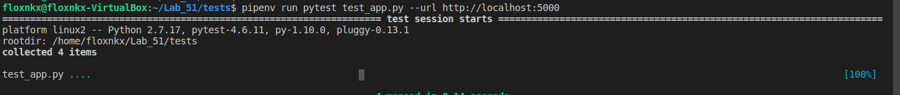
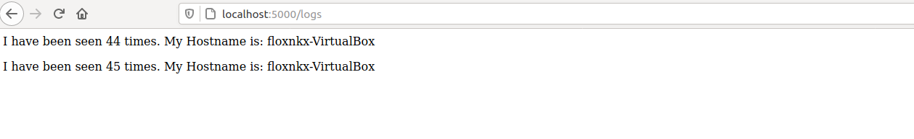
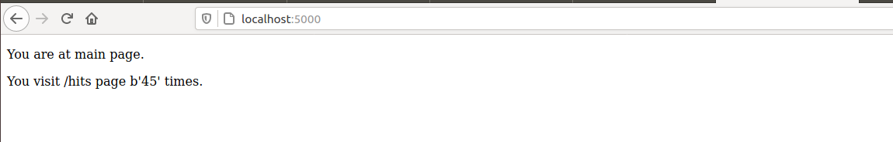
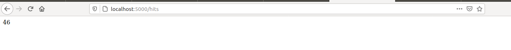

###  Лабораторна 5
***

1) Ознайомився з docker-compose.
2) Ознайомився з бібліотекою Flask. 
3) Створив папку my_app, tests. Скопіював файли з репозиторію devops_course.
4)  Виконав команди:  
```
        pip3 install redis
        pipenv --python 3.8
        pipenv install -r requirements.txt
        pipenv run python app.py
```
У іншій вкладці шелу ініціалізував середовище для 
тестів та запустив їх командою  
```
        pipenv run pytest test_app.py --url http://localhost:5000
```
* Результати тесту.
        * Для того, щоб тести працювали створив папку logs і лог-файл app.log у папці з додатком.
        
5) Видалив файли які були створені після тестового запуску. 
 Створив два файли: **Dockerfile** та **Makefile**;  
6) Опис директив мейкфайлу
   * STATES і REPO - змінні які містять назви тегів та назву Docker Hub репозиторію відповідно;
   * .PHONY - утиліта make, яка вказує файлу, що переліченні нище цілі не є файлами;  
   * app - білдить контейнер з додатком
   * tests - білдить контейнер з тестами
   * run - запускає контейнер та створює нетворк
   * test-app - запускає контейнер з тестами
   * prune - очищає невикористані контейнери, волюми, з'єднання та імеджі
7) Запустив сайт і тести.
```
        make run
        sudo make test-app
```
* Результат:     
   
   
   
8) Зупиняю проект, натиснувши **Ctrl+C**, та очищаю всі ресурси Docker за допомогою команди:
```
        sudo make docker-prune
```
9) Створюю директиву в Makefile для завантаження створених імеджів у Docker Hub репозиторій.
```
        make push
```
10) Видаляю створені та завантаженні імеджі. Створюю директиву delete-images в Makefile, яка автоматизує процес видалення імеджів. 

### Docker-compose
1) Створив **docker-compose.yml** у кориневій папці проекту. Є дві мережі - публічна та секретна.
Публічна мережа використовується  для загального доступу , а секретна для бекенду та баз даних.      	        	
2) Перевіряю чи Docker-compose встановлений та працює у моїй системі, а далі просто запускаю **docker-compose**:
```
        docker-compose version
        docker-compose -p lab5 up
```
3) Перевірив чи сайт працює. Для цього зайшов на адресу 127.0.0.1:80  
4) Перевірив чи докер компос створив необхідін імеджі.
```
        floxnkx@floxnkx-VirtualBox:~/Lab_51$ sudo docker images
        REPOSITORY          TAG                 IMAGE ID            CREATED             SIZE
        flox6375/lab5       compose-tests       d45feedb5d49        About an hour ago   147MB
        flox6375/lab5       compose-app         f40def119503        About an hour ago   143MB
        python              3.8-alpine          64df5e2068e3        2 weeks ago         44.5MB
        redis               alpine              c678242f9116        3 weeks ago         31.6MB
```
5) Зупинив проект, натиснувши **Ctrl+C**, і очищаю ресурси створені компоуз **docker-compose down**.
6) Завантажую створені імеджі до Docker Hub репозиторію за допомогою команди:
```
        docker-compose push
```
### Завдання 

1) На мою думку, docker-compose.yaml, так як за допомогою docker-compose можна визначити багатоконтейнерну структуру в одному файлі, потім працювати з своєю програмою виконуючи лише одну команду, яка робить усе необхідне для її запуску.

2) docker-compose.yaml створює два імеджі для Django сайту та моніторингу (docker-compose.yaml файл знаходиться тут);

* Запускаю docker-compose.yaml командою
```
        docker-compose -p lab4 up
```
* Зупиняю проект, натиснувши **Ctrl+C**, і очищаю ресурси створені компоуз **docker-compose down**.
