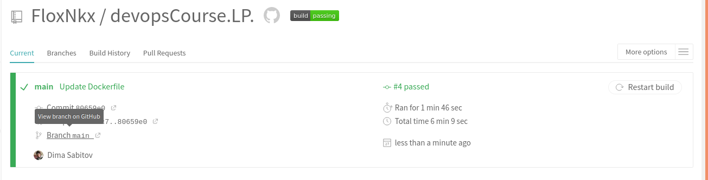

###  Лабораторна 6
***
1) Зареєструвався в системі Travis CI і додав потрібний репозиторій;
2) Ознайомвся з офіційною документацію та додав файл .travis.yml;
3) Запустив білд Тревіса (успіх);
    
4) Переписав білд lab 2 з використання кроків записаних у Makefile;
5) Переписав білд lab 4 для контейнера моніторингу;
6) Переписав білд lab 5 і додав кроки Makefile;
8) [Travis](https://travis-ci.com/github/FloxNkx/devopsCourse.LP.)
